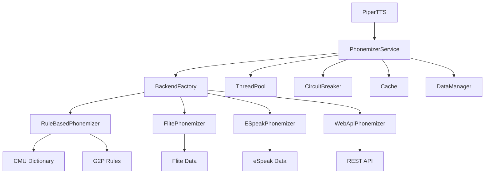

# Phase 3: 音素化システム技術仕様書

## 1. システム概要

### 1.1 目的
uPiperに柔軟でライセンスセーフな多言語音素化システムを実装し、高品質な音声合成を実現する。

### 1.2 設計原則
- **ライセンス安全性**: MITライセンス準拠のコアシステム
- **プラグイン可能**: 複数の音素化バックエンドをサポート
- **フォールバック**: 障害時の自動復旧機能
- **モバイル最適化**: 低メモリ・低CPU使用

## 2. アーキテクチャ

### 2.1 レイヤー構造

```
┌─────────────────────────────────────────────────┐
│            Unity Application Layer              │
├─────────────────────────────────────────────────┤
│         Phonemizer Service Layer                │
│  ┌─────────────────────────────────────────┐   │
│  │  ThreadSafePhonemizerPool               │   │
│  │  CircuitBreaker / ErrorHandler          │   │
│  │  CacheManager / DataManager             │   │
│  └─────────────────────────────────────────┘   │
├─────────────────────────────────────────────────┤
│         Phonemizer Backend Layer               │
│  ┌──────────┬──────────┬──────────┬────────┐  │
│  │RuleBased │  Flite   │ ESpeakNG │Web API │  │
│  │  (MIT)   │  (MIT)   │(GPL/Opt) │  (N/A) │  │
│  └──────────┴──────────┴──────────┴────────┘  │
└─────────────────────────────────────────────────┘
```

### 2.2 コンポーネント相関図



## 3. インターフェース定義

### 3.1 Core Interfaces

```csharp
namespace uPiper.Phonemizers
{
    /// <summary>
    /// 音素化バックエンドの基本インターフェース
    /// </summary>
    public interface IPhonemizerBackend : IDisposable
    {
        /// <summary>バックエンド名</summary>
        string Name { get; }
        
        /// <summary>サポート言語リスト</summary>
        string[] SupportedLanguages { get; }
        
        /// <summary>利用可能かチェック</summary>
        bool IsAvailable();
        
        /// <summary>優先度（高いほど優先）</summary>
        int Priority { get; }
        
        /// <summary>音素化実行</summary>
        Task<PhonemeResult> PhonemizeAsync(
            string text, 
            string language,
            PhonemeOptions options = null,
            CancellationToken cancellationToken = default);
    }
    
    /// <summary>
    /// 音素化オプション
    /// </summary>
    public class PhonemeOptions
    {
        /// <summary>IPA形式で返すか</summary>
        public bool UseIPA { get; set; } = true;
        
        /// <summary>ストレスマークを含むか</summary>
        public bool IncludeStress { get; set; } = false;
        
        /// <summary>音節境界を含むか</summary>
        public bool IncludeSyllables { get; set; } = false;
        
        /// <summary>カスタムパラメータ</summary>
        public Dictionary<string, object> CustomParams { get; set; }
    }
    
    /// <summary>
    /// 音素化結果
    /// </summary>
    public class PhonemeResult
    {
        /// <summary>成功フラグ</summary>
        public bool Success { get; set; }
        
        /// <summary>音素リスト</summary>
        public List<PhonemeToken> Phonemes { get; set; }
        
        /// <summary>使用されたバックエンド</summary>
        public string Backend { get; set; }
        
        /// <summary>処理時間（ミリ秒）</summary>
        public double ProcessingTimeMs { get; set; }
        
        /// <summary>エラー情報</summary>
        public string ErrorMessage { get; set; }
        
        /// <summary>警告情報</summary>
        public List<string> Warnings { get; set; }
    }
    
    /// <summary>
    /// 音素トークン
    /// </summary>
    public class PhonemeToken
    {
        /// <summary>音素文字列</summary>
        public string Phoneme { get; set; }
        
        /// <summary>音素ID（Piper用）</summary>
        public int PhonemeId { get; set; }
        
        /// <summary>継続時間（オプション）</summary>
        public float? Duration { get; set; }
        
        /// <summary>ストレスレベル（0-2）</summary>
        public int StressLevel { get; set; }
        
        /// <summary>音節境界フラグ</summary>
        public bool IsSyllableBoundary { get; set; }
    }
}
```

### 3.2 Service Layer Interfaces

```csharp
namespace uPiper.Phonemizers.Services
{
    /// <summary>
    /// 音素化サービスインターフェース
    /// </summary>
    public interface IPhonemizerService
    {
        /// <summary>テキストを音素化</summary>
        Task<PhonemeResult> PhonemizeAsync(
            string text,
            string language = null,
            PhonemeOptions options = null);
        
        /// <summary>バッチ音素化</summary>
        Task<PhonemeResult[]> PhonemizeBatchAsync(
            string[] texts,
            string language = null,
            PhonemeOptions options = null);
        
        /// <summary>利用可能な言語を取得</summary>
        string[] GetAvailableLanguages();
        
        /// <summary>データ管理</summary>
        IDataManager DataManager { get; }
        
        /// <summary>キャッシュ統計</summary>
        CacheStatistics GetCacheStatistics();
    }
    
    /// <summary>
    /// データ管理インターフェース
    /// </summary>
    public interface IDataManager
    {
        /// <summary>データパッケージの確認</summary>
        Task<bool> IsDataAvailable(string language);
        
        /// <summary>データのダウンロード</summary>
        Task<bool> DownloadDataAsync(
            string language,
            IProgress<float> progress = null);
        
        /// <summary>データサイズ取得</summary>
        long GetDataSize(string language);
        
        /// <summary>データ削除</summary>
        Task<bool> DeleteDataAsync(string language);
    }
}
```

## 4. 実装詳細

### 4.1 ルールベース音素化エンジン

```csharp
public class RuleBasedPhonemizer : IPhonemizerBackend
{
    private readonly Dictionary<string, IPronunciationDictionary> dictionaries;
    private readonly Dictionary<string, IG2PModel> g2pModels;
    
    public async Task<PhonemeResult> PhonemizeAsync(
        string text, 
        string language,
        PhonemeOptions options,
        CancellationToken cancellationToken)
    {
        var stopwatch = Stopwatch.StartNew();
        var result = new PhonemeResult
        {
            Backend = Name,
            Phonemes = new List<PhonemeToken>(),
            Warnings = new List<string>()
        };
        
        try
        {
            // 言語別の処理
            var processor = GetLanguageProcessor(language);
            var words = processor.Tokenize(text);
            
            foreach (var word in words)
            {
                cancellationToken.ThrowIfCancellationRequested();
                
                // 辞書検索
                if (dictionaries[language].TryGetPronunciation(
                    word, out var pronunciation))
                {
                    result.Phonemes.AddRange(
                        ConvertToPhonemeTokens(pronunciation, language));
                }
                else
                {
                    // G2P適用
                    var phonemes = g2pModels[language].Predict(word);
                    result.Phonemes.AddRange(
                        ConvertToPhonemeTokens(phonemes, language));
                    
                    result.Warnings.Add($"G2P used for: {word}");
                }
            }
            
            result.Success = true;
        }
        catch (Exception ex)
        {
            result.Success = false;
            result.ErrorMessage = ex.Message;
        }
        finally
        {
            result.ProcessingTimeMs = stopwatch.ElapsedMilliseconds;
        }
        
        return result;
    }
}
```

### 4.2 スレッドセーフ実装

```csharp
public class ThreadSafePhonemizerService : IPhonemizerService
{
    private readonly ObjectPool<IPhonemizerBackend> backendPool;
    private readonly SemaphoreSlim semaphore;
    private readonly ICircuitBreaker circuitBreaker;
    private readonly ICache<string, PhonemeResult> cache;
    
    public async Task<PhonemeResult> PhonemizeAsync(
        string text,
        string language,
        PhonemeOptions options)
    {
        // キャッシュチェック
        var cacheKey = GenerateCacheKey(text, language, options);
        if (cache.TryGet(cacheKey, out var cached))
        {
            return cached;
        }
        
        // Circuit Breaker チェック
        if (!circuitBreaker.CanExecute())
        {
            return await UseFallbackPhonemizer(text, language, options);
        }
        
        // スレッドセーフな実行
        await semaphore.WaitAsync();
        IPhonemizerBackend backend = null;
        
        try
        {
            backend = backendPool.Get();
            var result = await backend.PhonemizeAsync(
                text, language, options);
            
            circuitBreaker.OnSuccess();
            cache.Set(cacheKey, result);
            
            return result;
        }
        catch (Exception ex)
        {
            circuitBreaker.OnFailure(ex);
            throw;
        }
        finally
        {
            if (backend != null)
            {
                backendPool.Return(backend);
            }
            semaphore.Release();
        }
    }
}
```

### 4.3 データ管理実装

```csharp
public class PhonemizerDataManager : IDataManager
{
    private readonly string dataRoot;
    private readonly HttpClient httpClient;
    private readonly Dictionary<string, DataPackageInfo> packages;
    
    public async Task<bool> DownloadDataAsync(
        string language,
        IProgress<float> progress)
    {
        if (!packages.TryGetValue(language, out var packageInfo))
        {
            return false;
        }
        
        var localPath = Path.Combine(dataRoot, packageInfo.FileName);
        
        // 既存チェック
        if (File.Exists(localPath) && 
            await VerifyChecksum(localPath, packageInfo.Checksum))
        {
            return true;
        }
        
        // ダウンロード実行
        using var response = await httpClient.GetAsync(
            packageInfo.Url, 
            HttpCompletionOption.ResponseHeadersRead);
            
        response.EnsureSuccessStatusCode();
        
        var totalBytes = response.Content.Headers.ContentLength ?? 0;
        var downloadedBytes = 0L;
        
        using var stream = await response.Content.ReadAsStreamAsync();
        using var fileStream = new FileStream(
            localPath, FileMode.Create, FileAccess.Write, FileShare.None);
        
        var buffer = new byte[8192];
        int bytesRead;
        
        while ((bytesRead = await stream.ReadAsync(buffer)) > 0)
        {
            await fileStream.WriteAsync(buffer.AsMemory(0, bytesRead));
            downloadedBytes += bytesRead;
            
            progress?.Report((float)downloadedBytes / totalBytes);
        }
        
        // 解凍処理
        if (packageInfo.IsCompressed)
        {
            await ExtractPackage(localPath, Path.GetDirectoryName(localPath));
        }
        
        return true;
    }
}
```

## 5. プラットフォーム別実装

### 5.1 Unity統合

```csharp
[CreateAssetMenu(fileName = "PhonemizerSettings", 
    menuName = "uPiper/Phonemizer Settings")]
public class PhonemizerSettings : ScriptableObject
{
    [Header("Backend Configuration")]
    public BackendType preferredBackend = BackendType.RuleBased;
    public bool enableFallback = true;
    
    [Header("Performance")]
    public int maxConcurrency = 4;
    public int cacheSize = 1000;
    
    [Header("Data Management")]
    public bool autoDownloadData = false;
    public string[] preloadLanguages = { "en" };
    
    [Header("Advanced")]
    public bool enableCircuitBreaker = true;
    public int circuitBreakerThreshold = 3;
    public float circuitBreakerTimeout = 30f;
}
```

### 5.2 モバイル最適化

```csharp
#if UNITY_IOS || UNITY_ANDROID
public class MobilePhonemizerOptimizations
{
    // バッテリーセーブモード
    public static void EnableBatterySaveMode()
    {
        // 処理優先度を下げる
        QualitySettings.vSyncCount = 2;
        Application.targetFrameRate = 30;
        
        // キャッシュサイズを増やす
        PhonemizerService.Instance.SetCacheSize(2000);
        
        // バックグラウンド処理を制限
        PhonemizerService.Instance.SetMaxConcurrency(2);
    }
    
    // メモリ最適化
    public static void OptimizeMemoryUsage()
    {
        // 未使用データの解放
        Resources.UnloadUnusedAssets();
        GC.Collect();
        
        // コンパクトな辞書形式を使用
        PhonemizerService.Instance.UseCompactDictionary = true;
    }
}
#endif
```

## 6. エラーハンドリング

### 6.1 Circuit Breaker実装

```csharp
public class CircuitBreaker : ICircuitBreaker
{
    private readonly int threshold;
    private readonly TimeSpan timeout;
    private int failureCount;
    private DateTime lastFailureTime;
    private CircuitState state = CircuitState.Closed;
    
    public bool CanExecute()
    {
        lock (this)
        {
            if (state == CircuitState.Open)
            {
                if (DateTime.UtcNow - lastFailureTime > timeout)
                {
                    state = CircuitState.HalfOpen;
                    return true;
                }
                return false;
            }
            
            return true;
        }
    }
    
    public void OnSuccess()
    {
        lock (this)
        {
            failureCount = 0;
            state = CircuitState.Closed;
        }
    }
    
    public void OnFailure(Exception ex)
    {
        lock (this)
        {
            failureCount++;
            lastFailureTime = DateTime.UtcNow;
            
            if (failureCount >= threshold)
            {
                state = CircuitState.Open;
                LogError($"Circuit breaker opened: {ex.Message}");
            }
        }
    }
}
```

## 7. パフォーマンス仕様

### 7.1 目標性能

| メトリクス | 目標値 | 条件 |
|-----------|--------|------|
| 初期化時間 | <500ms | 英語データのみ |
| 音素化速度 | <50ms/100文字 | キャッシュミス時 |
| キャッシュヒット | <5ms | - |
| メモリ使用量 | <5MB | 基本構成 |
| 同時処理数 | 4 | デフォルト |

### 7.2 最適化手法

1. **キャッシング戦略**
   - LRUキャッシュ（デフォルト1000エントリ）
   - 永続キャッシュオプション

2. **バッチ処理**
   - 最大10テキストの同時処理
   - 自動バッチサイズ調整

3. **遅延読み込み**
   - 辞書データのオンデマンドロード
   - 使用頻度による優先度管理

## 8. セキュリティ考慮事項

1. **入力検証**
   - 最大文字数制限（10,000文字）
   - 特殊文字のサニタイズ

2. **データ保護**
   - ダウンロードデータのチェックサム検証
   - HTTPS必須

3. **リソース制限**
   - タイムアウト設定（30秒）
   - メモリ使用量上限

## 9. 将来の拡張性

1. **新規バックエンド追加**
   - IPhonemizerBackendインターフェースの実装
   - BackendFactoryへの登録

2. **カスタム辞書**
   - ユーザー定義発音辞書
   - ドメイン特化辞書

3. **機械学習統合**
   - ニューラルG2Pモデル
   - 文脈依存音素化

この技術仕様に基づいて、柔軟で拡張可能な音素化システムを実装します。