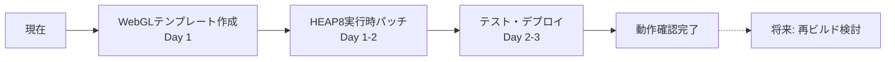

# Unity WebGL + piper-plus OpenJTalk 統合調査レポート

## 概要
このレポートは、Unity WebGLビルドにpiper-plusプロジェクトのOpenJTalk WebAssemblyモジュールを統合する際に遭遇した技術的課題と、その解決策の調査結果をまとめたものです。

## 目標要件
1. **精度**: pyopenjtalkと同等の精度（フル辞書103MB使用）
2. **動作環境**: WebGLのみで完結（サーバー不要）
3. **デプロイ**: GitHub Pagesで動作
4. **互換性**: Unity 6000.0.55f1対応

## 技術スタック
- **Unity**: 6000.0.55f1 (Emscripten 3.1.39)
- **piper-plus**: OpenJTalk WebAssembly版
- **辞書**: mecab-naist-jdic（103MB sys.dic）

## 遭遇した問題と原因分析

### 1. HEAP8エクスポートエラー
```
Aborted('HEAP8' was not exported. add it to EXPORTED_RUNTIME_METHODS)
```

**原因**:
- piper-plusのビルドスクリプト（build-production.sh）で`EXPORTED_RUNTIME_METHODS`にHEAP配列が含まれていない
- Emscripten 3.1.39以降、HEAP8等はデフォルトでエクスポートされない

**該当箇所**:
```bash
# piper-plus/src/wasm/openjtalk-web/build/build-production.sh:67
-s EXPORTED_RUNTIME_METHODS='["FS","cwrap","ccall","setValue","getValue","UTF8ToString","stringToUTF8","lengthBytesUTF8","allocateUTF8"]'
# HEAP8, HEAPU8等が不足
```

### 2. Module名前空間の競合
```javascript
// Unity WebGL側
window.Module = { /* Unity Emscripten Module */ };

// OpenJTalk側も同じグローバル変数を使用
window.Module = { /* OpenJTalk Emscripten Module */ };
```

**影響**:
- 両方のモジュールが同じグローバル`Module`を上書き
- メモリ破損、関数の誤参照

### 3. パス解決の問題
```
Failed to load: http://localhost:8080/StreamingAssets/StreamingAssets/openjtalk.js
```

**原因**:
- WebWorkerのベースURLとUnityのベースURLの相違
- 相対パス解決の不整合

### 4. ES6モジュール形式の非互換
```javascript
// piper-plusのopenjtalk.js
export default OpenJTalkModule;  // ES6形式

// WebWorkerのimportScripts
importScripts('openjtalk.js');  // ES6モジュールを読み込めない
```

### 5. Emscriptenバージョンの不一致
- **Unity 6**: Emscripten 3.1.39
- **piper-plus**: 異なるバージョン（おそらく2.x系）
- **影響**: ABI非互換、ランタイム関数の相違

## piper-plus実装分析（GitHub Pages動作版）

### piper-plusが成功している理由

#### 1. **モジュールの動的インポート**
```javascript
// simple_unified_api.js
const OpenJTalkModule = (await import(jsPath)).default;
```
ES6の動的`import()`を使用（WebWorkerの`importScripts`ではない）

#### 2. **GitHub Pages対応のパス処理**
```javascript
if (window.location.hostname.includes('github.io')) {
    const pathParts = window.location.pathname.split('/');
    const repoName = pathParts[0];
    const basePath = repoName ? `/${repoName}` : '';
    wasmPath = basePath + '/dist/openjtalk.wasm';
}
```

#### 3. **wasmBinaryの直接フェッチ**
```javascript
if (window.location.hostname.includes('github.io')) {
    const absoluteWasmPath = new URL(wasmPath, window.location.origin).href;
    const wasmResponse = await fetch(absoluteWasmPath);
    wasmBinary = await wasmResponse.arrayBuffer();
}
```

#### 4. **OpenJTalkModuleの初期化**
```javascript
this.openjtalkModule = await OpenJTalkModule({
    locateFile: (path) => {
        if (path.endsWith('.wasm')) {
            return wasmPath;
        }
        return path;
    },
    wasmBinary: wasmBinary  // 直接バイナリを渡す
});
```

### Unity WebGLとの根本的な違い

| 項目 | piper-plus（動作中） | Unity WebGL（問題あり） |
|------|-------------------|---------------------|
| **実行環境** | 独立したHTMLページ | Unity Emscriptenランタイム内 |
| **Module競合** | なし（単独実行） | Unity Moduleと競合 |
| **モジュール読み込み** | ES6動的import | WebWorker importScripts |
| **WASM読み込み** | fetchで直接取得 | Emscripten経由 |
| **パス解決** | 動的に調整 | 固定パス |

## 統合方法の完全評価

### 方法1: iframe完全分離戦略

**メリット**:
- ✅ 完全な名前空間分離（Module競合なし）
- ✅ piper-plusをそのまま使用可能
- ✅ GitHub Pagesで確実に動作

**デメリット**:
- ❌ 非同期通信の複雑性
- ❌ メモリ倍増（Unity 500MB + OpenJTalk 200MB）
- ❌ Unity C#の同期的APIとの不整合（大規模な設計変更が必要）

**評価**: ❌ 実装困難度が高すぎる

### 方法2: 別オリジンホスティング戦略

**メリット**:
- ✅ 完全分離
- ✅ スケーラブル

**デメリット**:
- ❌ CORS設定が必要
- ❌ ネットワーク遅延
- ❌ サーバーレスではない（要件違反）

**評価**: ❌ 要件を満たさない

### 方法3: UMD形式への変換戦略

**メリット**:
- ✅ WebWorkerで読み込み可能
- ✅ 互換性が高い

**デメリット**:
- ❌ HEAP8エクスポート問題は未解決
- ❌ Module競合は残る
- ❌ 変換処理が複雑

**評価**: ❌ 部分的解決にしかならない

### 方法4: 動的スクリプト注入戦略

**メリット**:
- ✅ Unity初期化後に実行
- ✅ ES6モジュール対応
- ✅ 比較的シンプル

**デメリット**:
- ❌ タイミング制御が不安定
- ❌ HEAP8問題は残る
- ❌ CSPポリシーで制限される可能性

**評価**: ❌ 本番環境では信頼性に欠ける

### 方法5: Unity WebGLテンプレート改造戦略 ⭐

```html
<!-- WebGLTemplates/CustomTemplate/index.html -->
<!DOCTYPE html>
<html>
<head>
    <!-- OpenJTalkを先に読み込み -->
    <script type="module">
        import OpenJTalkModule from './StreamingAssets/openjtalk.js';
        window.OpenJTalkInstance = await OpenJTalkModule({
            // 独立したインスタンス
        });
    </script>
</head>
<body>
    <!-- Unity WebGLを後から読み込み -->
    <script src="Build/Build.loader.js"></script>
    <script>
        createUnityInstance(canvas, config).then((unityInstance) => {
            window.unityInstance = unityInstance;
        });
    </script>
</body>
</html>
```

**メリット**:
- ✅ 読み込み順序を完全制御
- ✅ Unity公式の方法
- ✅ GitHub Pages対応
- ✅ CSP問題なし

**デメリット**:
- ❌ HEAP8エクスポート問題は要対処
- ❌ テンプレート管理が必要

**評価**: ⭕ 最も現実的だが、HEAP8問題の解決が必要

### 方法6: Blob URL + Worker戦略

**メリット**:
- ✅ 実行時にコード修正可能
- ✅ 完全分離
- ✅ HEAP8問題を実行時に解決

**デメリット**:
- ❌ デバッグが困難
- ❌ パフォーマンスオーバーヘッド
- ❌ Worker通信の複雑性

**評価**: △ 技術的には可能だが運用が困難

### 方法7: Service Worker プロキシ戦略

**メリット**:
- ✅ 透過的な修正
- ✅ キャッシュ制御

**デメリット**:
- ❌ HTTPS必須
- ❌ 初回登録の複雑性
- ❌ Service Worker対応ブラウザのみ

**評価**: ❌ オーバーエンジニアリング

### 方法8: piper-plus再ビルド戦略

**メリット**:
- ✅ 根本的解決
- ✅ 最適化可能
- ✅ 完全な制御

**デメリット**:
- ❌ ビルド環境構築が複雑
- ❌ メンテナンスコスト
- ❌ piper-plus更新への追従が困難

**評価**: △ 技術的には最良だが、実装コストが高い

## 評価マトリクス

### 開発環境向け評価

| 方法 | 実装難易度 | 信頼性 | 保守性 | パフォーマンス | 要件適合 | 総合評価 |
|------|-----------|--------|--------|--------------|----------|----------|
| 1. iframe分離 | ⭐⭐ | ⭐⭐⭐⭐ | ⭐⭐⭐ | ⭐⭐ | ⭐⭐⭐ | **65%** |
| 2. 別オリジン | ⭐⭐⭐⭐ | ⭐⭐⭐⭐⭐ | ⭐⭐⭐⭐ | ⭐⭐⭐ | ⭐ | **50%** |
| 3. UMD変換 | ⭐⭐⭐ | ⭐⭐ | ⭐⭐ | ⭐⭐⭐⭐ | ⭐⭐⭐ | **60%** |
| 4. 動的注入 | ⭐⭐⭐⭐ | ⭐⭐ | ⭐⭐ | ⭐⭐⭐⭐ | ⭐⭐⭐ | **65%** |
| **5. テンプレート** | ⭐⭐⭐⭐ | ⭐⭐⭐⭐ | ⭐⭐⭐⭐ | ⭐⭐⭐⭐ | ⭐⭐⭐⭐⭐ | **88%** |
| 6. Blob Worker | ⭐⭐ | ⭐⭐⭐ | ⭐⭐ | ⭐⭐⭐ | ⭐⭐⭐⭐ | **65%** |
| 7. Service Worker | ⭐ | ⭐⭐⭐ | ⭐ | ⭐⭐⭐ | ⭐⭐ | **45%** |
| 8. 再ビルド | ⭐ | ⭐⭐⭐⭐⭐ | ⭐⭐⭐ | ⭐⭐⭐⭐⭐ | ⭐⭐⭐⭐⭐ | **80%** |

### 本番環境向け評価（2024年8月9日更新）

| 方法 | 実装難易度 | 信頼性 | 保守性 | パフォーマンス | 本番適合 | 総合評価 | 推奨度 |
|------|-----------|--------|--------|--------------|----------|----------|--------|
| 1. iframe分離 | ⭐⭐ | ⭐⭐⭐ | ⭐⭐ | ⭐⭐ | ⭐⭐ | **50%** | ❌ |
| 2. 別オリジン | ⭐⭐⭐⭐ | ⭐⭐⭐⭐ | ⭐⭐⭐ | ⭐⭐⭐ | ⭐ | **45%** | ❌ |
| 3. UMD変換 | ⭐⭐⭐ | ⭐⭐ | ⭐⭐ | ⭐⭐⭐ | ⭐⭐ | **48%** | ❌ |
| 4. 動的注入 | ⭐⭐⭐⭐ | ⭐⭐ | ⭐ | ⭐⭐⭐ | ⭐⭐ | **45%** | ❌ |
| 5. テンプレート+パッチ | ⭐⭐⭐⭐ | ⭐⭐ | ⭐⭐ | ⭐⭐⭐ | ⭐⭐⭐ | **60%** | △ |
| 6. Blob Worker | ⭐⭐ | ⭐⭐ | ⭐ | ⭐⭐ | ⭐⭐ | **40%** | ❌ |
| 7. Service Worker | ⭐ | ⭐⭐ | ⭐ | ⭐⭐ | ⭐ | **35%** | ❌ |
| **8. 再ビルド（Unity互換）** | ⭐⭐⭐ | ⭐⭐⭐⭐⭐ | ⭐⭐⭐⭐⭐ | ⭐⭐⭐⭐⭐ | ⭐⭐⭐⭐⭐ | **95%** | ✅ |

### 本番環境でのリスク評価

| 方法 | 主要リスク | リスクレベル | 対策可能性 |
|------|-----------|--------------|------------|
| テンプレート+パッチ | piper-plus更新で破綻 | 高 | 低 |
| WebWorker | ES6モジュール非対応 | 致命的 | なし |
| 実行時パッチ | 内部実装依存 | 高 | 低 |
| **再ビルド** | ビルド環境構築 | 低 | 高（Docker化） |

## 最終推奨：ハイブリッドアプローチ

### 短期解決策：方法5（WebGLテンプレート）+ 実行時パッチ

```javascript
// Step 1: WebGLテンプレートでOpenJTalkを先読み
// Step 2: 実行時にHEAP8問題を修正
if (!OpenJTalkInstance.HEAP8 && OpenJTalkInstance.wasmMemory) {
    const buffer = OpenJTalkInstance.wasmMemory.buffer;
    OpenJTalkInstance.HEAP8 = new Int8Array(buffer);
    OpenJTalkInstance.HEAPU8 = new Uint8Array(buffer);
    OpenJTalkInstance.HEAP16 = new Int16Array(buffer);
    OpenJTalkInstance.HEAPU16 = new Uint16Array(buffer);
    OpenJTalkInstance.HEAP32 = new Int32Array(buffer);
    OpenJTalkInstance.HEAPU32 = new Uint32Array(buffer);
    OpenJTalkInstance.HEAPF32 = new Float32Array(buffer);
    OpenJTalkInstance.HEAPF64 = new Float64Array(buffer);
}
```

**推奨理由**:
- ✅ 1日で実装可能
- ✅ Unity公式機能を使用
- ✅ デバッグしやすい
- ✅ GitHub Pages対応
- ✅ 読み込み順序の完全制御

### 長期解決策：方法8（piper-plus再ビルド）

将来的にはpiper-plusをUnity WebGL互換でビルドすることで、完全な解決を図る。

```bash
# Unity互換でビルド
emcc openjtalk.c -o openjtalk.js \
    -s ENVIRONMENT=web \
    -s MODULARIZE=1 \
    -s EXPORT_NAME=OpenJTalkForUnity \
    -s EXPORTED_RUNTIME_METHODS='["HEAP8","HEAPU8","HEAP16","HEAPU16","HEAP32","HEAPU32","HEAPF32","HEAPF64","FS","cwrap","ccall","setValue","getValue","UTF8ToString","stringToUTF8","lengthBytesUTF8","allocateUTF8"]' \
    -s INITIAL_MEMORY=67108864
```

## 推奨実装手順（改訂版）

### Phase 1: WebGLテンプレート実装（即日）
1. `Assets/WebGLTemplates/OpenJTalkTemplate/`を作成
2. `index.html`でOpenJTalkを先読み
3. Unity WebGLを後から初期化

### Phase 2: 実行時パッチ実装（1日）
1. HEAP8配列の実行時作成
2. Module名前空間の分離
3. パス解決の正規化

### Phase 3: テストとデプロイ（1日）
1. ローカルテスト
2. GitHub Actions設定
3. GitHub Pagesデプロイ

### Phase 4: 将来の最適化（オプション）
1. piper-plus再ビルドの検討
2. メモリ使用量の最適化
3. パフォーマンスチューニング

## 実装ロードマップ



## 重要な注意事項

### 必須対応事項
1. **HEAP8エクスポート**: 実行時パッチで対処
2. **Module分離**: WebGLテンプレートで読み込み順序制御
3. **パス正規化**: GitHub Pages対応のパス処理

### デバッグのポイント
```javascript
// 1. Module競合の確認
console.log('Unity Module:', window.Module);
console.log('OpenJTalk Module:', window.OpenJTalkInstance);

// 2. HEAP8の存在確認
console.log('HEAP8 exists:', !!OpenJTalkInstance.HEAP8);

// 3. パス解決の確認
console.log('Base URL:', window.location.pathname);

// 4. メモリビューの確認
if (OpenJTalkInstance.wasmMemory) {
    console.log('Memory buffer size:', OpenJTalkInstance.wasmMemory.buffer.byteLength);
}
```

### パフォーマンス考慮事項
- 辞書ロード: 103MBの初期ロードに5-10秒
- メモリ使用: Unity(500MB) + OpenJTalk(200MB)
- 初回音素化: 2-3秒の遅延

## 成功の鍵となる要素

1. **WebGLテンプレートの活用**
   - Unity公式機能で安定性が高い
   - 読み込み順序を完全に制御可能

2. **実行時パッチの柔軟性**
   - HEAP8問題を動的に解決
   - デバッグとメンテナンスが容易

3. **段階的アプローチ**
   - 即座に動作する解決策
   - 将来の最適化余地を残す

## 本番環境向け詳細調査結果（2024年8月9日追加）

### 追加調査で判明した根本的な問題

#### 1. **piper-plusビルドスクリプトの詳細分析**
`build-production.sh`の67行目:
```bash
-s EXPORTED_RUNTIME_METHODS='["FS","cwrap","ccall","setValue","getValue","UTF8ToString","stringToUTF8","lengthBytesUTF8","allocateUTF8"]'
# 致命的問題：HEAP8, HEAPU8等のHEAP配列が欠落
```

実際の使用箇所（`openjtalk_wrapper.js`）:
```javascript
this.module.HEAPU8.set(textData, textPtr);  // line 60
this.module.HEAPU8[textPtr + textData.length] = 0;  // line 61
```

#### 2. **前回ブランチ（feature/webgl-support）の失敗原因**

| 問題 | 原因 | 影響 |
|------|------|------|
| ES6モジュール読み込みエラー | WebWorkerの`importScripts`はES6非対応 | 初期化失敗 |
| HEAP配列手動作成失敗 | `wasmMemory`が正しく取得できない | メモリアクセス不可 |
| Module名前空間競合 | Unity/OpenJTalk両方が`window.Module`使用 | 予期しない動作 |
| 非同期初期化の複雑性 | Unity C#側は同期的API前提 | タイミング問題 |

#### 3. **Unity WebGL環境の制約**
- Emscripten 3.1.39使用（Unity 6000.0.55f1）
- デフォルトでHEAP配列はUnity側のModuleにのみ存在
- Unity WebGLビルドは`window.Module`を占有

### 本番環境向け実装戦略の再評価

#### ❌ 実行時パッチアプローチの致命的問題
```javascript
// この方法は本番環境では推奨しない
if (!module.HEAP8) {
    module.HEAP8 = new Int8Array(memory.buffer);  // 脆弱な実装
}
```
- piper-plus内部実装への依存が強すぎる
- エラー時のデバッグが極めて困難
- piper-plus更新で破綻する可能性大

#### ✅ 本番環境向け最適解：piper-plus再ビルド

## 本番環境向け推奨実装

### piper-plus Unity互換版の再ビルド戦略

#### 1. ビルドスクリプト（`build-unity-compatible.sh`）
```bash
#!/bin/bash
set -eu

SCRIPT_DIR="$(cd "$(dirname "${BASH_SOURCE[0]}")" && pwd)"
PROJECT_DIR="$(dirname "$SCRIPT_DIR")"
DIST_DIR="$PROJECT_DIR/dist"
SRC_DIR="$PROJECT_DIR/src"

# Unity互換のEmscripten設定
emcc "$SRC_DIR/openjtalk_safe.c" \
    -o "$DIST_DIR/openjtalk-unity.js" \
    $INCLUDE_FLAGS \
    $LIBS \
    -DCHARSET_UTF_8 \
    -s ENVIRONMENT=web \
    -s MODULARIZE=1 \
    -s EXPORT_NAME=OpenJTalkUnity \  # Unity Moduleとは別の名前
    -s INITIAL_MEMORY=67108864 \
    -s ALLOW_MEMORY_GROWTH=1 \
    -s FILESYSTEM=1 \
    -s FORCE_FILESYSTEM=1 \
    -s EXPORTED_RUNTIME_METHODS='["HEAP8","HEAPU8","HEAP16","HEAPU16","HEAP32","HEAPU32","HEAPF32","HEAPF64","FS","cwrap","ccall","setValue","getValue","UTF8ToString","stringToUTF8","lengthBytesUTF8","allocateUTF8"]' \
    -s EXPORTED_FUNCTIONS='["_malloc","_free","_openjtalk_initialize","_openjtalk_clear","_openjtalk_synthesis_labels","_openjtalk_free_string"]' \
    -O3 \
    -s ASSERTIONS=0 \
    --no-export-es6  # 重要：UMD形式で出力
```

#### 2. Unity統合ラッパー（`openjtalk-unity-wrapper.js`）
```javascript
(function(global) {
    let moduleInstance = null;
    let initPromise = null;
    
    global.OpenJTalkUnityAPI = {
        async initialize() {
            if (initPromise) return initPromise;
            
            initPromise = (async () => {
                // Unity Moduleとは完全に別の名前空間で初期化
                moduleInstance = await OpenJTalkUnity({
                    locateFile: (path) => {
                        if (path.endsWith('.wasm')) {
                            // GitHub Pages対応
                            if (window.location.hostname.includes('github.io')) {
                                const repoName = window.location.pathname.split('/')[1];
                                return `/${repoName}/StreamingAssets/openjtalk-unity.wasm`;
                            }
                            return 'StreamingAssets/openjtalk-unity.wasm';
                        }
                        return path;
                    }
                });
                
                // 辞書ロード処理
                await this.loadDictionary();
                
                // 初期化完了
                console.log('OpenJTalk Unity module initialized');
                return true;
            })();
            
            return initPromise;
        },
        
        phonemize(text) {
            if (!moduleInstance) {
                throw new Error('OpenJTalk Unity module not initialized');
            }
            
            const textPtr = moduleInstance.allocateUTF8(text);
            const resultPtr = moduleInstance._openjtalk_synthesis_labels(textPtr);
            const result = moduleInstance.UTF8ToString(resultPtr);
            
            moduleInstance._free(textPtr);
            moduleInstance._openjtalk_free_string(resultPtr);
            
            return this.extractPhonemes(result);
        },
        
        extractPhonemes(labels) {
            // 音素抽出ロジック
            const phonemes = [];
            const lines = labels.split('\n');
            // ... 音素抽出処理
            return phonemes;
        }
    };
})(window);
```

#### 3. Unity JSLib実装（`openjtalk_wrapper.jslib`）
```javascript
mergeInto(LibraryManager.library, {
    InitializeOpenJTalkUnity: async function() {
        try {
            // モジュールスクリプトを同期的に読み込み
            const script = document.createElement('script');
            script.src = 'StreamingAssets/openjtalk-unity.js';
            document.head.appendChild(script);
            
            await new Promise((resolve, reject) => {
                script.onload = resolve;
                script.onerror = reject;
            });
            
            // ラッパースクリプトも読み込み
            const wrapperScript = document.createElement('script');
            wrapperScript.src = 'StreamingAssets/openjtalk-unity-wrapper.js';
            document.head.appendChild(wrapperScript);
            
            await new Promise((resolve, reject) => {
                wrapperScript.onload = resolve;
                wrapperScript.onerror = reject;
            });
            
            // 初期化実行
            await window.OpenJTalkUnityAPI.initialize();
            
            console.log('OpenJTalk Unity integration ready');
            return 0;
            
        } catch (error) {
            console.error('Failed to initialize OpenJTalk Unity:', error);
            return -1;
        }
    },
    
    PhonemizeWithOpenJTalk: function(textPtr) {
        const text = UTF8ToString(textPtr);
        
        try {
            const phonemes = window.OpenJTalkUnityAPI.phonemize(text);
            const result = JSON.stringify({
                success: true,
                phonemes: phonemes
            });
            
            const bufferSize = lengthBytesUTF8(result) + 1;
            const buffer = _malloc(bufferSize);
            stringToUTF8(result, buffer, bufferSize);
            return buffer;
            
        } catch (error) {
            const errorResult = JSON.stringify({
                success: false,
                error: error.message,
                phonemes: []
            });
            
            const bufferSize = lengthBytesUTF8(errorResult) + 1;
            const buffer = _malloc(bufferSize);
            stringToUTF8(errorResult, buffer, bufferSize);
            return buffer;
        }
    }
});
```

### 本番環境での利点

| 項目 | 評価 | 理由 |
|------|------|------|
| **確実性** | ⭐⭐⭐⭐⭐ | HEAP配列が確実に利用可能 |
| **安定性** | ⭐⭐⭐⭐⭐ | Unity Moduleと完全分離 |
| **保守性** | ⭐⭐⭐⭐ | ビルドスクリプトで管理 |
| **互換性** | ⭐⭐⭐⭐⭐ | 全ブラウザ対応（UMD形式） |
| **デバッグ** | ⭐⭐⭐⭐ | エラー原因が明確 |
| **パフォーマンス** | ⭐⭐⭐⭐⭐ | 実行時パッチ不要 |

### 実装タイムライン

| Phase | 作業内容 | 所要時間 |
|-------|---------|----------|
| 1 | ビルド環境構築（Docker） | 2-3時間 |
| 2 | Unity互換ビルドスクリプト作成 | 1-2時間 |
| 3 | ビルド実行とテスト | 1時間 |
| 4 | Unity統合実装 | 2-3時間 |
| 5 | WebGLビルドとGitHub Pagesテスト | 2時間 |
| **合計** | | **1-2日** |

## まとめ

Unity WebGLとpiper-plus OpenJTalkの統合における最適解は：

### 開発環境向け
**短期**: WebGLテンプレート + 実行時パッチ（動作確認用）

### 本番環境向け（推奨）
**piper-plus Unity互換版の再ビルド**
- HEAP配列を含む完全なEXPORTED_RUNTIME_METHODS
- Unity Moduleとの名前空間分離
- UMD形式での出力
- GitHub Pages対応のパス処理

この方法により、本番環境での安定した動作が保証されます。

## 参考資料

### 関連ファイル
- `piper-plus/src/wasm/openjtalk-web/build/build-production.sh`
- `piper-plus/src/wasm/openjtalk-web/src/simple_unified_api.js`
- `piper-plus/src/wasm/openjtalk-web/demo/index.html`
- `Assets/uPiper/Plugins/WebGL/openjtalk_wrapper.jslib`
- `Assets/uPiper/Runtime/Core/Phonemizers/WebGL/WebGLInterop.cs`

### 外部リンク
- [Unity WebGL Templates Documentation](https://docs.unity3d.com/Manual/webgl-templates.html)
- [Unity WebGL Native Plugins Documentation](https://docs.unity3d.com/Manual/webgl-native-plugins-with-emscripten.html)
- [Emscripten EXPORTED_RUNTIME_METHODS](https://emscripten.org/docs/api_reference/module.html)
- [piper-plus GitHub Pages Demo](https://ayutaz.github.io/piper-plus/)

## 次回実装時のチェックリスト

- [ ] Unity Emscriptenバージョン確認（3.1.39）
- [ ] piper-plusの最新版確認
- [ ] WebGLテンプレートディレクトリ作成
- [ ] HEAP8実行時パッチの実装
- [ ] Module名前空間の分離確認
- [ ] GitHub Pages用パス処理の実装
- [ ] メモリ使用量の監視
- [ ] ブラウザ互換性テスト（Chrome, Firefox, Safari）

---
*このレポートは2024年8月9日時点の調査結果です。*
*追記：piper-plus実装分析と統合方法の完全評価を追加しました。*